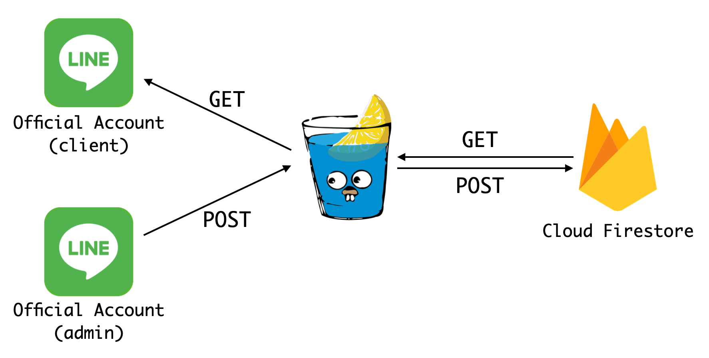

# fish-marketing-linebot

This repo aims to promote the fish stall in 新北市汐止區金龍市場.

## Architechure

`clientbot/`: Line bot for delivering fish price to customers

`firestore/`: Provide the API for interact with Cloud Firestore

`admin`: Line bot for updating fish price

## Client Linebot

> LINE ID: @667ibfnw

## TODO

- [ ] `firestore/`: testing

- [ ] location / helping msg
